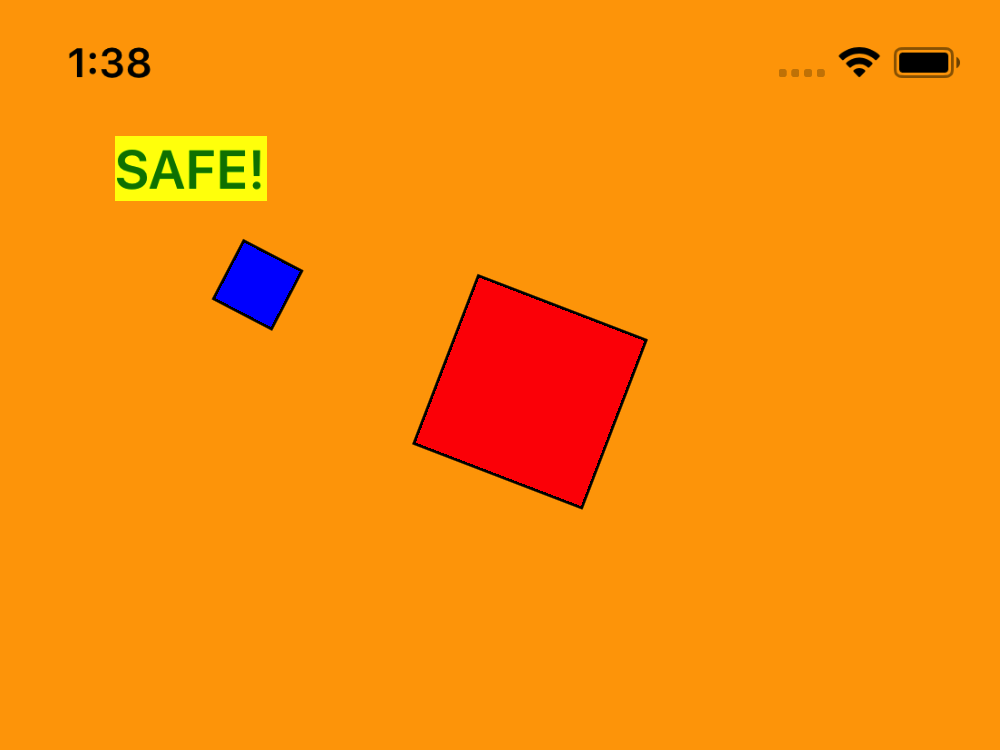
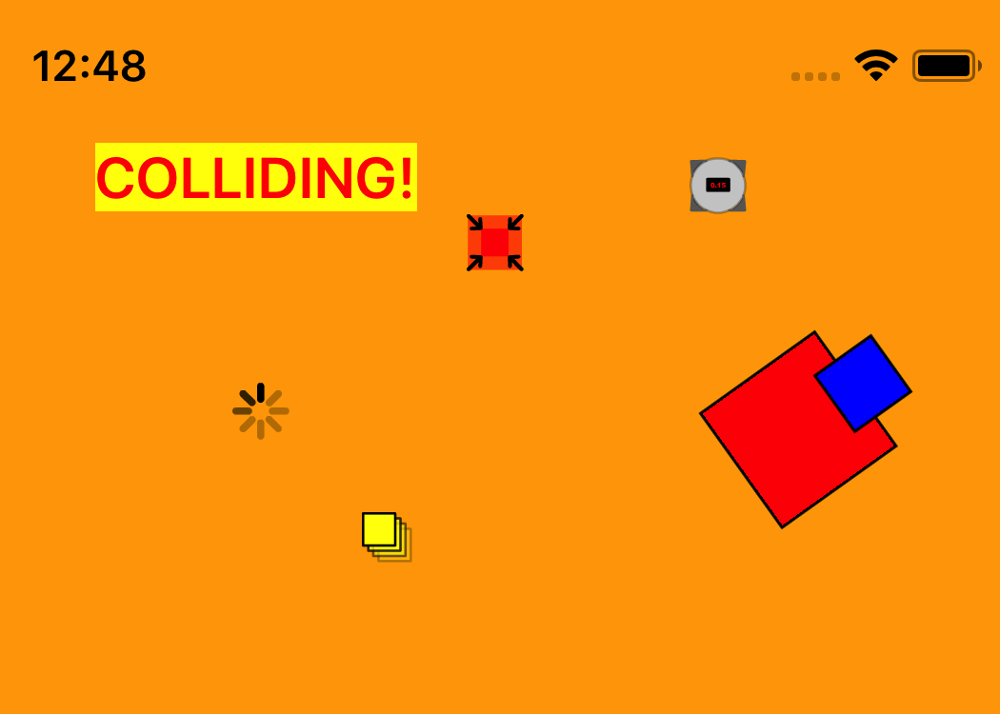

<div align="center">
    
    
</div>

# React Native Typescript 2D Game (The Box)

## About

### Background

Around 2006, my brother made a simple Flash game called [The Box](https://birchlabs.co.uk/legacy/TheBox.html). In this game, you'd control a small blue box that has to run away from an ever-growing red box that is hunting it. The game would end upon the blue box being caught. You could attempt to live longer by picking up power-ups that would hinder the red box, but loss was ultimately inevitable.

### This project

This repository aims to reproduce The Box using modern mobile technologies. It's available on the Expo app store [here](https://expo.io/@bottledlogic/the-box). Aspects that are implemented so far:

- [x] INTERACTIVE: Tap (or drag) to command the blue box where to go
- [x] AI: Blue box follows the red box  
- [x] GAMEPLAY: Basic rectangle-based collision detection  
- [x] GRAPHICAL: Boxes rotate in the direction of movement 
- [x] GRAPHICAL: Runs at 60fps (both JS and UI thread) on both iOS Simulator and iPhone 5S
- [x] OPTIMISATION: Game's state update is synced with the screen refresh via a bespoke-made StateBatcher
- [x] OPTIMISATION: Eliminate slowdown upon addition of extra components into tree (via `shouldComponentUpdate()`)
- [x] GAMEPLAY: Add items

To-do:

- [ ] UX: Integrate a router to show different screens (e.g. start, options, etc.)
- [ ] ARCHITECTURE: integrate Redux to manage state
- [ ] GAMEPLAY: Make the game end, and display a score (for time lived) upon collision
- [ ] GAMEPLAY: Separating Axis Theorem-based collision detection
- [ ] OPTIMISATION: Investigate using [object pools](https://www.html5rocks.com/en/tutorials/speed/static-mem-pools/) to reduce heap load (as iOS simulator's garbage collection is noticeable)
- [ ] OPTIMISATION: Convert graphics from being React Native Views to being canvas layers (or similar)
- [ ] OPTIMISATION: Use React Native's [Animated](https://facebook.github.io/react-native/docs/animated.html) library, as by [Wix](https://github.com/wix-incubator/rn-perf-experiments2/blob/master/src/AnimatedScrollView.js), to reduce '[crossing the bridge](https://www.youtube.com/watch?v=OmiXlJ4ZzAo)'

## Technologies

I'm using:

* **Expo:** for rapid development of the app (allows you to develop without touching Xcode/Android Studio; is pre-configured with hot-reloading; has its own app store for instant publishing; provides debug tools, etc.).

* **React Native:** as a library for developing an cross-platform phone app using React's reactive architecture.

* **React Game Kit:** simply for providing a game loop by which to synchronise state/graphics updates.

* **TypeScript:** to write type-safe, refactorable, auto-completing code yet still output JavaScript (the language of React Native).

For instructions on how exactly to make a project like this for yourself from scratch, read the repository wiki's [How I created this project](https://github.com/shirakaba/react-native-typescript-2d-game/wiki/How-I-created-this-project) page.
 

## Usage

### Installing as an app in the Expo Client

If you just want to try out the game without interacting with the repository, you can download it in the Expo Client via the URL:

https://exp.host/@bottledlogic/the-box

... Otherwise, follow the instructions in the next section to build it yourself.

### Building from this repository

#### Global dependencies

If you haven't made a `create-react-native-app` project before, you may need to install the Xcode command-line tools (if you're a Mac user), `yarn`, `create-react-native-app` itself, and `watchman`. Here are the instructions to get set up (for Mac):

```bash
brew update # For good luck
xcode-select --install
brew install yarn # This also implicitly installs a copy of node under brew (without npm)
yarn global add create-react-native-app
brew install watchman # Maybe not required, but I did it just in case.
```

#### Installation

```bash
git clone git@github.com:shirakaba/react-native-typescript-2d-game.git
cd react-native-typescript-2d-game
yarn install
```

#### Running in the simulator

Either of these commands will load your app into the Expo app in your phone simulator. I believe the Expo app itself gets installed onto the simulator as a result of `yarn global add create-react-native-app` (or simply during the first time that either of these commands is run).

```bash
yarn run ios
```

or:

```bash
yarn run android
```

Once the app is running, simply click anywhere on the screen to command the blue box! 

#### Troubleshooting

Refer to [How I created this project: Troubleshooting](https://github.com/shirakaba/react-native-typescript-2d-game/wiki/How-I-created-this-project#Troubleshooting)

## Licences

### Sounds

All sounds gratefully sourced from [Taira Komori](http://taira-komori.jpn.org/freesounden.html).

Terms of use [here](http://taira-komori.jpn.org/freesounden.html). In brief: "free of charge and royalty free in your projects... be it for commercial or non-commercial purposes".

| Direct download  | Webpage |
| ------------- | ------------- |
| [attack1.mp3](http://taira-komori.jpn.org/sound_os/attack01/attack1.mp3)  | [Martial Arts > SF](http://taira-komori.jpn.org/attack01en.html)  |
| [attack2.mp3](http://taira-komori.jpn.org/sound_os/attack01/attack2.mp3)  | [Martial Arts > SF](http://taira-komori.jpn.org/attack01en.html)  |
| [bomb.mp3](http://taira-komori.jpn.org/sound_os/arms01/bomb.mp3)  | [Arms Explosion > Explosion,Launcher](http://taira-komori.jpn.org/arms01en.html)  |
| [explosion1.mp3](http://taira-komori.jpn.org/sound_os/arms01/explosion1.mp3)  | [Arms Explosion > Explosion,Launcher](http://taira-komori.jpn.org/arms01en.html)  |
| [swing1.mp3](http://taira-komori.jpn.org/sound_os/attack01/swing1.mp3)  | [Martial Arts > Swinging](http://taira-komori.jpn.org/attack01en.html)  |
| [swing3.mp3](http://taira-komori.jpn.org/sound_os/attack01/swing1.mp3)  | [Martial Arts > Swinging](http://taira-komori.jpn.org/attack01en.html)  |

He also makes these available on [freesound](https://freesound.org/people/Taira%20Komori/) under a [Attribution 3.0 Unported (CC BY 3.0)](https://creativecommons.org/licenses/by/3.0/) licence.